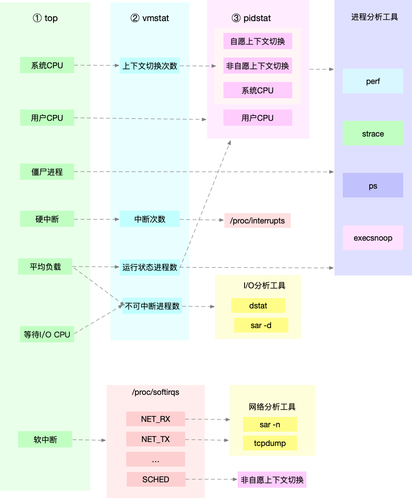

# 如何查找系统Linux的CPU性能瓶颈

## CPU有哪些性能指标?
### CPU使用率
+ **用户CPU使用率**   包含us和ni.  用户CPU高说明有应用程序比较占用CPU. 
+ **系统CPU使用率**   sy, 表示CPU内核运行占用CPU 
+ **等待I/O的CPU使用率** iowaith 
+ **软中断和硬中断**  si和wa 
+ **cpu缓存命中率** 


### 平均负载
使用uptime, top命令查看瓶颈负载

### 上下文切换
+ 自愿上下文切换
+ 非自愿上下文切换

## 如何使用工具查看性能指标? 

**根据指标找性能工具: **

+  平均负载: 
	+ uptime
	+ top
+  CPU使用率:  
	+  vmstat 
	+  mpstat
	+  top
	+  sar
	+  /proc/stat

+ 系统上下文切换
	+ vmstat


+ 进程上下文切换
	+ pidstat 
+ 软中断
	+ top
	+ /proc/softirqs
	+ mpstat
+ 硬中断
	+ vmstat
	+ /proc/interrupts
+ 网络
	+ data
	+ sar
	+ tcpdump
+ I/O
	+ dstat
	+ sar
+ CPU个数
	+ /proc/cpuinfo
+ 事件
	+ prof 

### 根据工具查性能指标
+ uptime 
	+ 查看平均负载 显示 过去1, 5, 15分钟的平均负载
		```
		root@server1:~# uptime
		 16:49:52 up 5 days, 23:26,  1 user,  load average: 0.00, 0.00, 0.00
		```
+ top
+ htop
+ atop
+ vmstat
+ mpstat
+ pidstat
+ /proc/softirq
+ /proc/interrupts
+ ps
+ pstree
+ dstat
+ star
+ strace
+ perf
+ execsnoop

## 如何分析CPU性能瓶颈?




