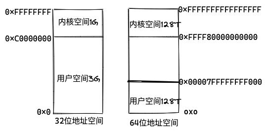
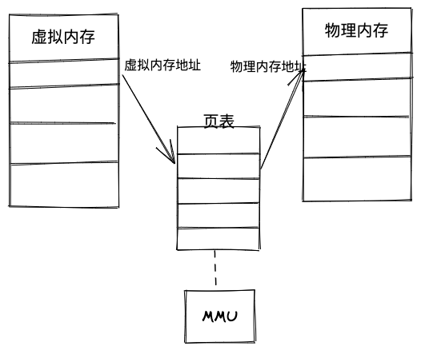

# 内存是怎样工作的

## 内存映射

Linux系统给每个进程提供了一个独立的并且连续的虚拟地址空间. 

**虚拟内存分布:**


不是所有的虚拟内存都会分配物理内存, 只有实际使用的虚拟内存才会分配物理内存, 分配物理内存通过**内存映射**管理.

内存映射: 将虚拟内存映射到物理内存地址.  内核中为每个进程维护一张页表, 记录虚拟地址和物理地址映射关系.  页表存储在CPU的内存**管理单元MMU**中, CPU可以直接通过硬件直接找到要访问的内存.



当进程的虚拟地址在页表中查不到时,  系统就会产生一个缺页异常, 进入内核空间分布物理内存, 更新进程页表. 

TLB(Translation Lookaside Buffer)是MMU中的页表的高速缓存.

**多级页表:**
MMU映射内存的最小单位称为**页**,通常为4kb, 每次内存映射都需要关联4KB或者4KB整数倍的内存空间. 

页的大小通常只有4KB,在大内存的情况下,页表会变得很大. 为了解决这个问题, Linux提供了**多级页表**和**大页(HugePage)**两种机制. 

Linux 使用四级页表管理内存页, 虚拟地址分为5个部分, 前4个表用于选择页, 最后一个索引表页内偏移. 

Linux多级页表


虚拟内存分布:

用户空间的内存从低到高五种不同的段:
	1. 只读段  代码和常量 
	2. 数据段  全局变量
	3. 堆		 动态分配的内存,从地址向上增长
	4. 文件映射段  动态库, 共享内存, 从高地址向想下增长
	5. 栈  局部变量, 函数调用上下文. 一般固定为8MB


## 内存分配与回收

1.**小块内存(小于128K)**.  C标准库使用brk()分配. 通过移动堆顶的位置分配内存. 内存释放后不会立刻归还系统,  缓存起来重复利用. 频繁的分配和释放会造成**内存碎片**. 小于1KB的内存, 在内核空间使用slab分配器管理小内存.

2.**大块内存(大于128K).**  使用内存映射 mmap() 分配. 从**文件映射段** 找一段空闲内存分配出来 . 释放时直接归还系统. 每次分配都发生  **缺页异常** ,   频繁分配会导致大量的缺页异常, 导致**内核繁忙**. 

**调用内存分配时并没有真正的分配内存, 都是在首次访问内存时才通过缺页异常进入内核中, 通过内核分配内存**


**当系统内存紧张时, Linux会回收内存:**

+ 回收缓存, 使用 LRU 算法回收最近使用最少的内存内存页面

+ 回收不长访问的内存.  把不常访问的内存通过swap写入磁盘

+ 使用OOM杀死进程.  使用 oom_score 为每个进程的内存使用情况评分:

  + 进程消耗内存越大, oom_score越大
  + 进程运行占用的CPU越多, oom_score越小 

  可用通过/proc文件系统手动设置oom_adj 调整进程的oom_score, oom_adj 范围:[-17,15] 数值越大容易被系统oom杀死,  -17表示禁止 禁止oom.

  设置oom_adj `echo -16 > /proc/$(pidof sshd)/oom_adj`

## 如何查看内存使用情况

### 使用free查看系统整体内存情况

```
root@server1:~# free
              	total        used        free      shared  buff/cache   available
Mem:        8054924      313996     4128972        1500     3611956     7449944
Swap:       4194300           0     4194300
```

+ total 总内存大小
+ used 已使用内存大小
+ free 未使用内存大小
+ shared共享内存大小
+ buff/cache 缓存和缓冲区大小
+ available 新进程可用的内存大小

available 比较包含未使用内存,还包含可回收缓存. 

不是所有的缓存都可以回收, 有些正在使用的缓存不能被回收. 

### 使用top或者ps显示整个系统的内存使用情况

**top:**

```
top - 07:05:41 up 6 days, 13:42,  1 user,  load average: 0.00, 0.00, 0.00
Tasks: 124 total,   1 running, 123 sleeping,   0 stopped,   0 zombie
%Cpu(s):  0.0 us,  0.2 sy,  0.0 ni, 99.8 id,  0.0 wa,  0.0 hi,  0.0 si,  0.0 st
MiB Mem :   7866.1 total,   4036.1 free,    302.5 used,   3527.5 buff/cache
MiB Swap:   4096.0 total,   4096.0 free,      0.0 used.   7279.5 avail Mem

    PID USER      PR  NI    VIRT    RES    SHR S  %CPU  %MEM     TIME+ COMMAND
      1 root      20   0  169404  13724   8492 S   0.0   0.2   0:25.82 systemd
      2 root      20   0       0      0      0 S   0.0   0.0   0:00.07 kthreadd
      3 root       0 -20       0      0      0 I   0.0   0.0   0:00.00 rcu_gp
      4 root       0 -20       0      0      0 I   0.0   0.0   0:00.00 rcu_par_gp
```

+ VIRT 进程虚拟内存的大小  
+ RES 常驻内存大小.  进程实际使用的物理内存大小, 不包含swap和共享内存.
+ SHR 共享内存大小  与其他进程共同使用的共享内存, 加载的动态链接库,已经程序代码段
+ %MEM 检查使用物理内存占系统总内存的百分比


