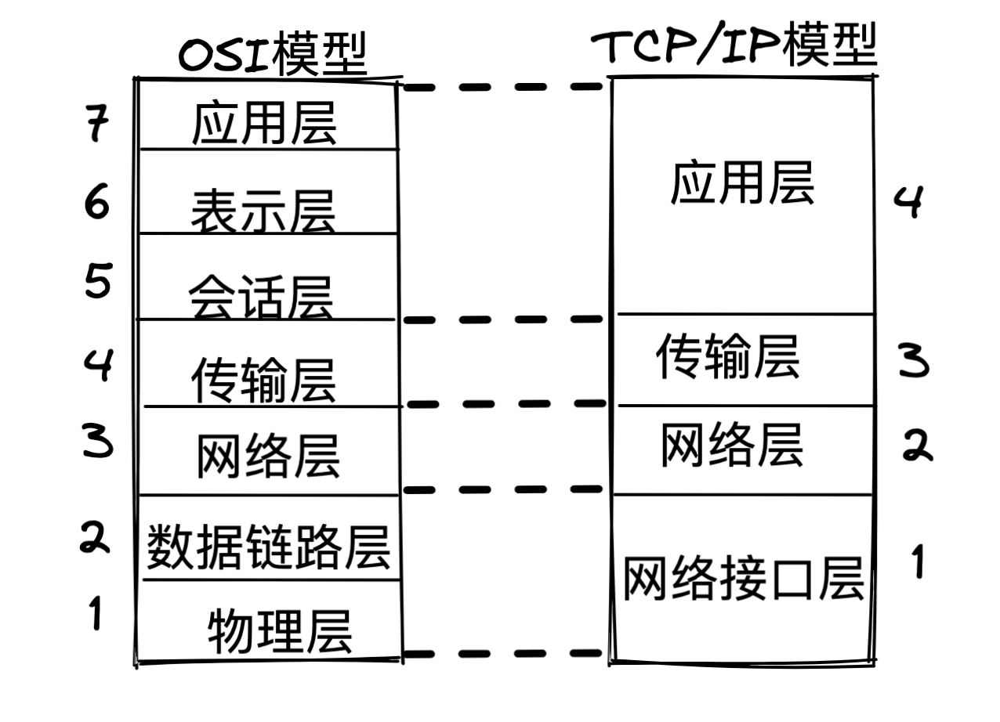
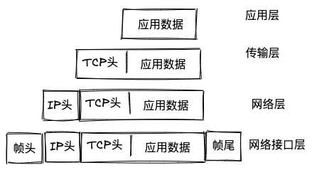
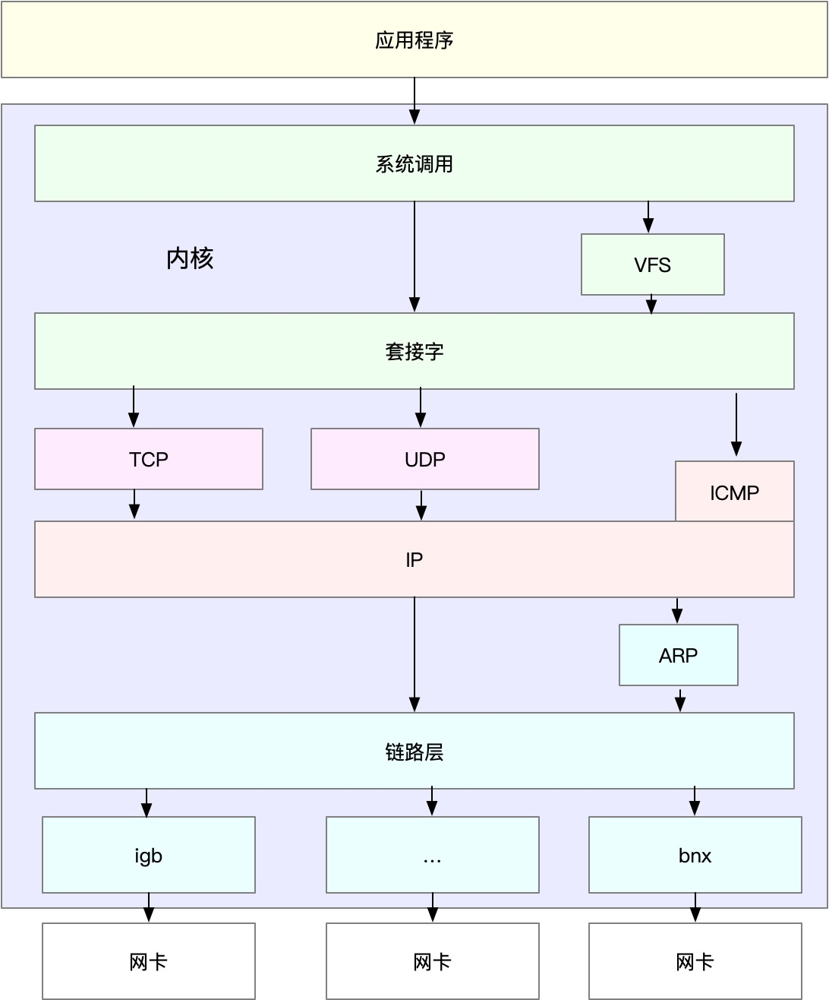
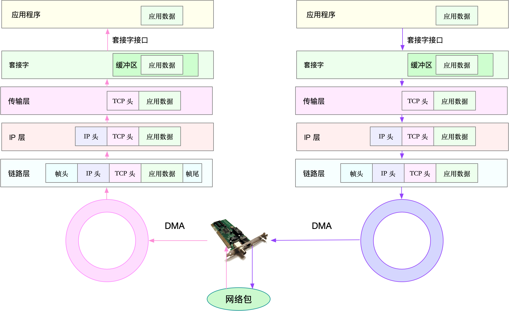

# Linux网络

## 网络模型

osI七层网络模型:

+ 应用层	 为应用程序提供统一的接口
+ 表示层   把数据转换成兼容接收系统的格式
+ 会话层  维护计算机之间的通信连接
+ 传输层  为数据加上传输表头, 形成数据包
+ 网络层  数据的路由和转发 
+ 数据链路层  MAC寻址, 错误侦测和改错
+ 物理层  物理网络上的传输数据帧

TCP/IP网络模型: 

+ 应用层 向用户提供应用程序, HTTP FTP  DNS
+ 传输层  端到端的通信.  TCP, UDP 
+ 网络层  负责网络包的封装, 寻址, IP, ICMP
+ 网络接口层  负责网络包在物理网络中的传输,  例如MAC寻址, 错误侦测, 以及网卡传输网络帧. 

TCP/IP网络模型和OSI七层模型对应关系:

## Linux网络栈

在网络传输时, 数据包会按照协议栈对上一层发来的数据进行逐层处理 

TCP协议通讯的网络包每层封装格式:

+ 传输层在应用数据签名增加了TCP头
+ 网络层在TCP数据包签名增加了IP头
+ 网络接口成在IP数据前后分别增加了帧头和帧尾

物理链路中只能传输网络接口配置最大传输单元(MTU)大小的包, 一旦网络包超过MTU的大小,就会在网络层进行分片,分片后的包不大于MTU值. MTU越大需要分包就越小 网络吞吐能力就越好. 

**Linux 通用 IP 网络栈:**

+ 最上层的应用程序 需要通过系统调用根套接字进行交互
+ 套接字的小米 就是传输层,网络层, 网络接口层
+ 最底层 为网卡驱动程序和网卡设备

网卡是发送和接收网络包的基本设备, 在系统启动过程中, 网卡通过内核中的网卡驱动程序注册到系统中, 在网络收发过程中, 内核通过中断更网卡进行交互.

网中断只会处理网卡数据的读取或者发送,  协议栈中大部分的逻辑放到软中断中处理

## 网络包收发流程

**网络包的接收流程:** 

+ 当网络帧到达网卡后,网卡会通过DMA方式,把这个网络包放到收包队列中, 然后通过硬中断通知处理程序已经收到网络包

+ 网卡中断处理程序会为网络帧分配内核数据结构(sk_buff), 并将其拷贝到sk_buff缓冲区,然后通过软中断通知内核收到了新的网络帧. 

+ 内核协议栈从缓冲区取出网络帧, 并同网络协议栈从下到上逐层处理这个网络帧.  

  + 在链路层检查报文的合法性, 找出上层的协议类型(IPv4,IPv6), 再去掉帧头,帧尾,然后交给网络层
  + 网络层取出IP头, 判断网络包的下一步走向(交给上层处理或者转发), 当网络层确定包要发到本机后,就会取出上层协议的类型(TCP,UDP) 去掉IP头, 交给传输成处理
  + 传输层取出TCP头或者UDP头, 根据<源IP,源端口, 目的IP,目的端口> 四元组作为表示,找到对应的Socket,并把数据拷贝到Socket的接收缓存中, 最后应用程序就能读取到数据. 

  

**网络发包流程:**

+ 应用程序调用socket API(sendmsg)系统调用 发送网络包, 陷入内核态, 套接字会把数据包放到Socket的发送缓冲区中.
+ 网络协议栈从Socket发送缓冲区中取出数据包, 再按照TCP/IP协议栈从上到下逐层封装处理, 执行路由查找确认下一跳的 IP，并按照 MTU 大小进行分片。分片后的网络包，再送到网络接口层，进行物理地址寻址，以找到下一跳的 MAC 地址。然后添加帧头和帧尾，放到发包队列中。这一切完成后，会有软中断通知驱动程序：发包队列中有新的网络帧需要发送。最后，驱动程序通过 DMA ，从发包队列中读出网络帧，并通过物理网卡把它发送出去。

应用程序通过套接字接口发送数据包，先要在网络协议栈中从上到下进行逐层处理，最终再送到网卡发送出去。而接收时，同样先经过网络栈从下到上的逐层处理，最终才会送到应用程序。

